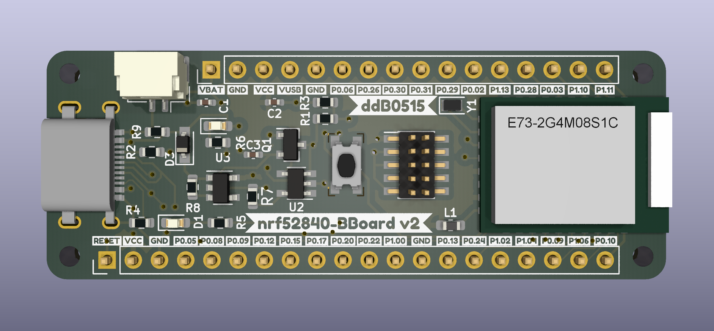

nRF52840-BBoard

Based on Ebyte E73 module with nRF52840
More details here: https://www.ebyte.com/en/product-view-news.aspx?id=445

Managed to fit all into breakout board (4 layers) with Lipo charger (not yet tested fully) and USB-C with modified Adafruit nRF52 Bootloader
https://github.com/ddB0515/Adafruit_nRF52_Bootloader/tree/nrf52840-bboard

when managed to build and get bootloader you need to flash it (I have JLink so was easy to get it flashed)
Double click on reset button to get into DFU mode

Bootloader is in `bootloader` folder and should work if you don't wanna build it

To flash it with JLink all you need is in `bootloader` folder:
nrf52840_bboard_bootloader-0.5.1-2-g881dac1-dirty_s140_6.1.1.hex

To update it via serial(if already flashed via Jlink)

`
adafruit-nrfutil --verbose dfu serial --package nrf52840_bboard_bootloader-0.5.1-2-g881dac1-dirty_s140_6.1.1.zip --port /dev/ttyACM0 -b 115200 --singlebank --touch 1200
`

# Interactive BOM
[Interactive BOM](http://htmlpreview.github.io/?https://raw.githubusercontent.com/ddB0515/nRF52840-BBoard/main/bom/ibom.html)

# TODO
- Submit board to Adafruit Bootloader repo
- Add board to Communitiy nRF52 (https://github.com/jpconstantineau/Community_nRF52_Arduino)
- Get more samples/demos to provide with board
